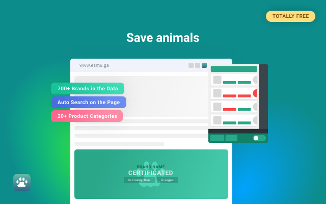
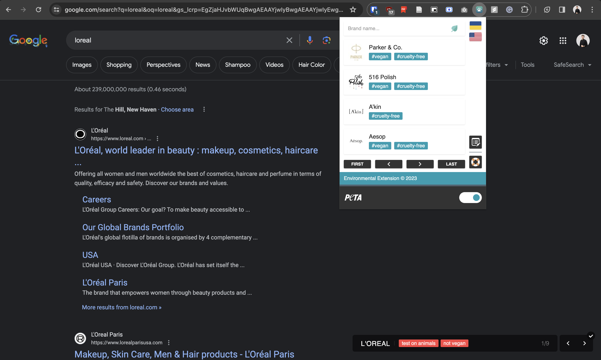

# TurBOTa for Chrome

TurBOTa for Chrome is a browser extension designed to help you check the cruelty-free status of brands with ease. By using this extension, you can quickly determine whether the products you're interested in are tested on animals or not. Take a stand for ethical consumption and support brands that prioritize cruelty-free practices. 

## Installation

You can install TurBOTa for Chrome directly from the [Chrome Web Store](https://chrome.google.com/webstore/detail/turbota-for-chrome/pkaofffddmleggdkmemhadkbbfiaipfa?utm_source=ext_app_menu). 

## Why is it important?

Acquiring products that are not tested on animals encourages brands to embrace a cruelty-free philosophy and seek certification from PETA (People for the Ethical Treatment of Animals). TurBOTa aims to accelerate the adoption of cruelty-free principles, especially among the younger generation in Ukraine. By downloading this extension, you can stay informed about brands that either ignore ethical considerations or use non-natural materials in their products.

## How does it work?

TurBOTa for Chrome operates seamlessly as you browse the web. When you open a web page, the extension scans for brands and provides information about their cruelty-free status. This process is incredibly swift, taking only a second, and the results are displayed in the bottom right corner of your screen. Additionally, you have the flexibility to enable or disable the extension's functions as needed.

At present, TurBOTa boasts a database of over 600 brands, and our team is committed to expanding it further through regular updates. If you can't find a specific brand in our database, you can easily request its addition through the extension's popup.

## Privacy and Advertisement-Free

Rest assured that TurBOTa does not collect any user data, ensuring your online privacy is maintained. The extension is completely free of advertisements, providing a smooth and uninterrupted browsing experience.

## Developed with Love by NGO ESMU Team

TurBOTa for Chrome is a labor of love developed by the dedicated team at NGO ESMU. We are passionate about promoting cruelty-free consumption and making it more accessible to everyone.

Thank you for supporting ethical choices and helping us advance the culture of cruelty-free products in Ukraine and beyond. Download TurBOTa for Chrome today and make informed decisions about the brands you choose to support!
